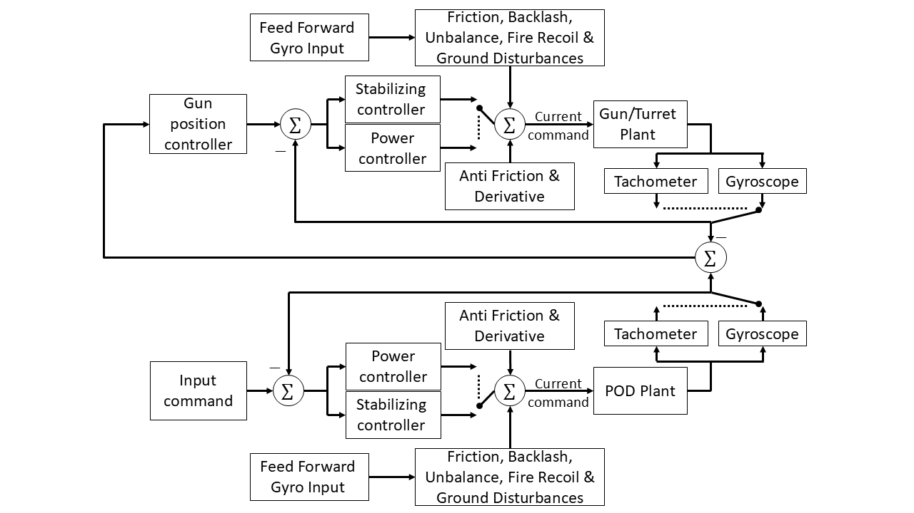

# Final Project - Simulation of an inertial stabilization servo control system

The project implements the development of a servo control system simulation for inertial stabilization of a weapon system mounted on a vehicle.

## Project Overview

The project system focuses on stability control and inertial stabilization of rotating weapon systems. The mechanical system consists of a rotating body (the gun), connected to an electric servo motor through a gear system. The mechanical connection between the motor and the rotating body is described in a physical model known as a "molecule", in which the moments of inertia, stiffness and restraint of the gear are represented as a spring and a rotary damper

The system operates in two main modes of operation:
* Torque Mode: In this mode, the system uses the measurements of the relative angular velocity of the tachometer, to generate appropriate current commands to the motor. The commands are controlled by PI controllers and pure gain controllers, which allow for accurate and fast response for the purposes of direct control of the force applied to the load.
* Stabilization Mode: In stabilization mode, a gyroscope sensor is used to measure the angular velocity of the rotating body relative to the ground, enabling inertial stability control. In this mode, the system neutralizes external disturbances such as ground disturbances, friction, imbalance, and mechanical freedom (backlash) using advanced control techniques (such as notch-filters, anti-friction, and differentiator) to maintain the angle of the gun stable and inertial.

### Sensors in the system

* Tachometer - located on the motor shaft and measures relative speed Ωm . Due to simple dynamics (single integrator) it is suitable for building a fast power circuit.
* Gyroscope - mounted on the load body and measures inertial speed ΩL relative to the ground. The sensor directly detects external disturbances and is therefore used in the external stabilization loop.

### The Molecular Model
The molecular model is a simulation approach to platform control, consisting of models of nonlinear components such as friction, inertia, and free moments. The name "molecule" refers to the description of complex processes using simple elements connected in a structure that simulates a mechanical system with freedom of movement, restraint, and stiffness. Using this model, we divided the system into inertial blocks (assemblies). Each inertial block is characterized by a moment (units of Newton∙meter). Any two such blocks can be described as a driving block and a driven block, the dynamics between which can be described as a spring and a restrainer.

### Physical modeling

Using the molecular model, we fitted the measurements given to us for the pair of different modes on each axis. To estimate the constants KK and KV, we used the analysis of the transfer function from the motor current to the tachometer and gyroscope and by examining the given Bode diagrams.

### Linear Control

The linear control was built using the loop-shaping method. It included several different components:
1. Fixed gain
2. PI controller
3. Notch filter for resonance damping
4. Low-Pass filter

This is to meet a number of defined requirements:
- Steady state error 0 for step input
- Bandwidth of over 5 Hz
- Gain of over 20 dB at 1 Hz
- Phase margin of over 40°
- Gain margin of over 6 dB
- Step response with overshoot up to 25%

### Non-Linear Control

To perform a simulation that is true to reality, we added nonlinear elements that should increase the accuracy of the simulation.

#### Coulomb friction
In the connection of gears, a constant resistance torque Tcoulomb appears that changes sign with the direction of rotation.
In our model it is represented as: 
$T_{Coulomb\  friction}=T_Q*sign(ω)$ 
where $ω$ is the angular velocity measured by the tachometer/gyroscope.

#### Backlash

In gears there is a tiny gap $Δθ$ where the rotation of the drive gear still does not move the load gear. To measure the gap, the motor is started very slowly, the angle of the motor and the load is monitored, and the “jump” required until the load begins to respond is identified. In the Simulink model, the freedom is described as a Dead-Zone, as long as the difference $θ_m-θ_L$ is less than $Δθ$, there is no torque transfer.

#### Unbalance

When the center of gravity of the barrel or auxiliary equipment is mounted at a distance $r$ from the axis of rotation, a cyclic torque is created whose magnitude varies with the angle of rotation $θ$. This is because the weight $mg$ acts off the centerline, and therefore tries to tilt the system with each rotation. To estimate the torque, low-speed rotation is performed in an open circuit, the motor current is measured in the “up” and “down” directions, and the average is translated into the $T_UB$ value and similarly for the traverse axis.

#### Fire Recoil

With each shot, a strong blow is released back along the barrel axis, creating a short but very large acceleration. To measure it, high-G range accelerometers were mounted near the barrel. The sensors recorded the acceleration of the blow, and after integration, the angular deviation created immediately after the shot is calculated from it.

### FeedForward Techniques

#### Differentiator
The ground disturbances are measured by attaching a gyroscope to the gun on each axis and measuring when the vehicle is traveling on a track with a speed of 25 km/h. The disturbance velocity measurement $ω_{disturbance}$ is derived in time and converted to a moment of inertia, using the motor inertia $J_M$ : 
$I_{diff}^{Control}=\frac{-J_M}{K_T}*\frac{d}{dt}(ω_{disturbance})$ 
This contribution returns a current proportional to the disturbance acceleration to the motor.

#### Anti-Friction
To deal with the friction, an anti-friction is used:  
$I_{friction}^{Control}=-\frac{T_Q}{K_T}*sign(ω)$ 
Multiplying $T_Q$ by the current constant $\frac{1}{K_T}$ yields a current that cancels the friction at the mechanical level, and the use of the minus sign allows the effect of friction on the system to be reduced.

### Enslavement

The weapon is controlled through the observation system. For this purpose, state-space controllers were designed that also meet the given control requirements, and they allow for tracking targets and provide a proper tracking error for each axis separately.
The enslavement is based on returning the angle difference between the weapon and the observation pod to the weapon system space-state controller, thereby correcting the weapon system angle.

### Block Diagram of the Complete System

The complete system implementation is given by the following block diagram:

## Getting Started

### Prerequisites
* Matlab version R2020b or later
* Simulink
* [Project directory](Project)

### Installation
1. Download and install Matlab with Simulink from [Matlab website](https://www.mathworks.com/products/matlab.html).
2. Download the [Project directory](Project).
3. Change the folder path in Matlab to the location of the folder from previous stage.
4. Run the 'load_files.m' file in Matlab.
5. Open the '.slx' file in Simulink.

## Usage
Inside Simulink, double-click the GUI block, from where the entire system is controlled.

The system is divided into 3 parts:
- 2 axes - the elevation axis (at the top of the GUI) and the Traverse axis (at the bottom of the GUI). The control of each axis is independent of the other axis.
- A 'Run' button with a scope below it.

### Axis Control
Each axis is divided into 3 areas:
1. Gun system
2. Optics system (called Pod)
3. Tracking execution

#### Gun System Panel

On the left side of the panel, you can control the following components:
1. Adding ground disturbances to the system.
2. Adding friction to the physical modeling of the system.
3. The left switch - adding an anti-friction feedforward technique, the right switch - adding a differentiator feedforward technique.
4. Adding backlash to the physical modeling of the system.
5. The left switch - closing a loop for the system, the right switch - closing a tachometric (up) or gyroscopic loop (down).
6. The left switch - inserting a step (up) or an external signal (down), the right switch - selecting the step height to be 1 (up) or 0.05 (down).

On the right side of the panel, the following signals can be viewed by double-clicking on the appropriate scope:
1. Gun system angle relative to the ground as measured by the gyroscopic mode.
2. Gun system speed relative to the ground as measured by the gyroscopic mode.
3. Gun system speed relative to the engine as measured by the tachometric mode.
4. Ground disturbance input.
5. Fire recoil from the gun.

#### Pod System Panel

On the left side of the panel, you can control the following components:
1. Connecting the gun system to the observation pod.
2. Adding friction to the physical modeling of the system.
3. Adding a feedforward technique.
4. Adding backlash to the physical modeling of the system.
5. The left switch - closing a loop for the system, the right switch - closing a tachometric (up) or gyroscopic loop (down).
6. The left switch - inserting a step (up) or an external signal (down), the right switch - if the tracking signal is a step - selecting the step height to be 1 (up) or 0.05 (down).

> [!NOTE]
> It is not possible to introduce ground disturbances into only one of the systems since the enslavement is based, among other things, on the fact that the two systems experience the same disturbances and therefore the subtraction between them manages to overcome the disturbances.

On the right side of the panel, the following signals can be viewed by double-clicking on the appropriate scope:
1. Pod system angle relative to the ground as measured by the gyroscopic mode.
2. Pod system speed relative to the ground as measured by the gyroscopic mode.
3. Pod system speed relative to the engine as measured by the tachometric mode.

#### Tracking Panel

On the left side of the panel you can control:
1. Whether to insert a tracking signal into the observation pod.
2. Whether the tracking signal will be the given signal (up) or a step signal (down).
3. If the tracking signal is a step - is it at a height of 1 (up) or 0.05 (down).

On the right side of the panel, the following signals can be viewed by double-clicking on the appropriate scope:
1. Error signal between weapon angle and pod angle.
2. Integrated control scope including:
   - Ground disturbances entering the system
   - Fire recoil
   - Weapon angle
   - Pod angle
   - Tracking input
   - Tracking error

### Running Panel

Clicking the run button will run the simulation.

The simulation time will vary depending on the selections made in the switches and will be determined by the more stringent axis.

Below the run button there is a scope that displays the tracking error in the elevation axis as a function of the tracking error in the traverse axis. It displays approximately the last 15 seconds.

> [!IMPORTANT]
> The desired scopes must be opened before pressing the run button, in order to observe the system operation during runtime.

> [!CAUTION]
> Do not click the scope below the run button. It opens automatically when the simulation starts.
> Closing it after it opens will speed up the simulation run.
